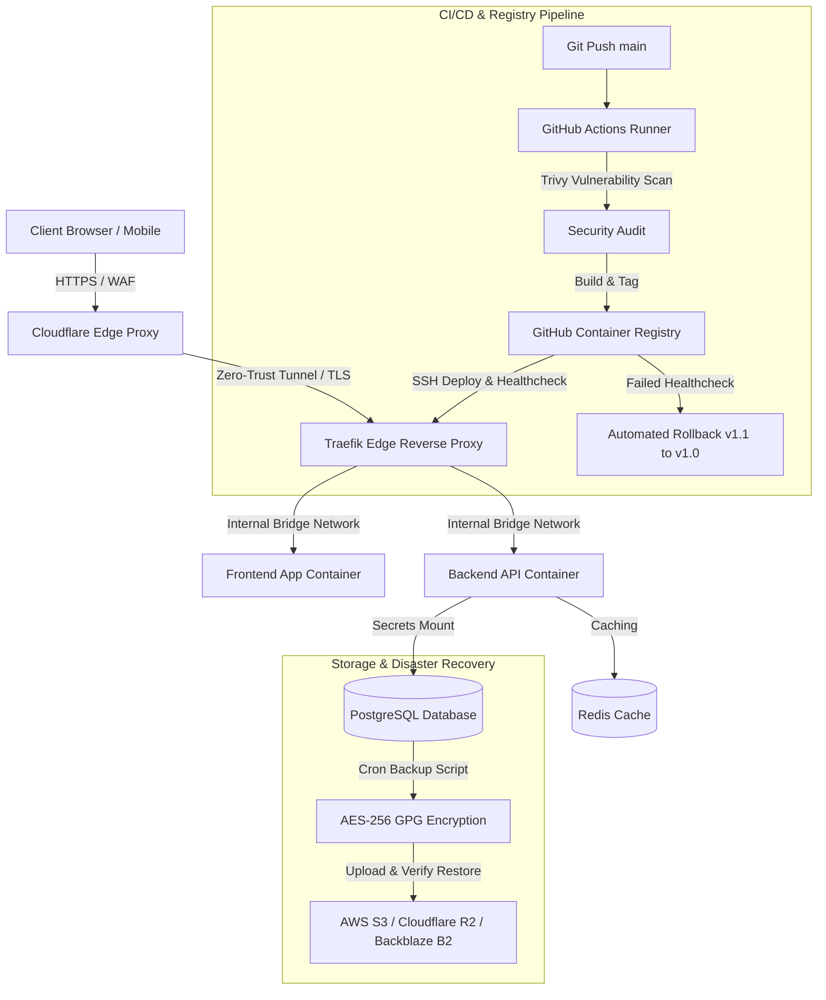

### 🚀 **[DevOps & Cloud](README.md)** ︱ 💻 **[Software Engineering](SOFTWARE_DEV.md)** ︱ 🏛️ **[System Design](SYSTEM_DESIGN.md)** ︱ 🧠 **[DSA & Algorithms](DSA.md)**

---

> 🏆 **Flagship Architecture:** View the **[Production Multi-Tenant SaaS Platform](https://github.com/nurekowser01/production-multi-tenant-platform)** combining DevOps, System Design, and Software Engineering into a single coherent system.

---

# Nure Kowser — Multi-Disciplinary Engineer

Passionate DevOps, Cloud Architect, and Systems Security Engineer specializing in production infrastructure automation, container orchestration, edge security, self-hosted deployment platforms, and zero-trust disaster recovery.

---

## Technical Core & Capabilities

- **Containerization & Orchestration:** Docker, Docker Compose, Multi-stage Builds, Distroless Images, Container Security, Resource Scoping.
- **PaaS & Self-Hosted Infrastructure:** Dokploy, Coolify, Traefik Dynamic Reverse Proxy, `acme.json` Certificate Security, Volume Backups.
- **Continuous Integration & Delivery:** GitHub Actions, GHCR, Immutable Tags, Automated Rollbacks, Blue/Green & Rolling Zero-Downtime Deployments.
- **Cloud & Object Storage Engineering:** AWS S3, Cloudflare R2, Backblaze B2, S3 API Integration, KMS SSE, Lifecycle Policies, Automated Restore Verification.
- **Edge Networking & Security:** Cloudflare WAF, Cloudflare Tunnel (`cloudflared`), DNS-only vs Proxied Edge TLS, Least-Privilege API Tokens.
- **Linux Security & Server Hardening:** Ed25519 SSH Key Governance, Staged Lockout Prevention, UFW/iptables Host Firewalls, Docker `iptables` Port Exposure Defense, Unattended Security Updates, Sysctl Kernel Hardening.
- **Reliability, Backup & Observability:** Database & Volume Backup Engines (GPG Encryption), RPO/RTO Metrics, Prometheus, Grafana, SigNoz OpenTelemetry, Production Disaster Recovery Runbooks.

---

## Production Lifecycle Architecture

---

## Portfolio Engineering Repositories

### Core Infrastructure & Container Orchestration
- 🐳 **[devops-docker](https://github.com/nurekowser01/devops-docker):** Production multi-stage Docker builds, Alpine/distroless minimal footprints, non-root users, resource constraints, logging drivers, and container vulnerability scanning.
- 🐙 **[devops-docker-compose](https://github.com/nurekowser01/devops-docker-compose):** Multi-tier stack (Traefik, Node.js API, PostgreSQL, Redis) with container healthchecks, internal networks, secrets management, and persistent named volumes.
- 🚀 **[devops-dokploy](https://github.com/nurekowser01/devops-dokploy):** Self-hosted Dokploy PaaS setup, Git integration, persistent volume backups, Traefik integration, and `acme.json` certificate protection.
- ⚡ **[devops-coolify](https://github.com/nurekowser01/devops-coolify):** Coolify deployment orchestration, Nixpacks integration, automated database backups, and documented Dokploy vs Coolify performance and architecture trade-offs.
- 🚥 **[devops-traefik](https://github.com/nurekowser01/devops-traefik):** Dynamic Docker provider proxying, Let's Encrypt TLS challenges, middlewares (Rate limiting, IP allowlists, security headers), and `acme.json` certificate backup routines.
- 🔒 **[devops-ssl-tls](https://github.com/nurekowser01/devops-ssl-tls):** Certificate lifecycle automation, Let's Encrypt ACME HTTP-01/DNS-01 challenges, Cloudflare origin certs, and trade-off analysis of Cloudflare SSL modes (Flexible vs Full vs Full Strict).

### CI/CD, Registry & Deployment Automation
- ⚙️ **[devops-github-actions](https://github.com/nurekowser01/devops-github-actions):** Production CI/CD workflow (`lint` -> `unit-test` -> `trivy-scan` -> `docker-build` -> `ghcr-push` -> `ssh-deploy` -> `healthcheck`).
- 📦 **[devops-container-registry](https://github.com/nurekowser01/devops-container-registry):** GHCR, Docker Hub, and AWS ECR image management, semantic tagging, sha-256 immutability, vulnerability scanning, and Docker registry layer backup & retention policies.
- 🔄 **[devops-deployment-rollback](https://github.com/nurekowser01/devops-deployment-rollback):** Automated health-check failure detection script triggering instant fallback (`v1.1` -> `v1.0`), versioned image tags, and database migration safety runbooks.
- 🌐 **[devops-zero-downtime-deployment](https://github.com/nurekowser01/devops-zero-downtime-deployment):** Blue/Green deployment scripts, rolling update configurations, health readiness probes, and TCP connection draining strategies.

### Cloud & Object Storage Engineering
- 🪣 **[devops-aws-s3](https://github.com/nurekowser01/devops-aws-s3):** Terraform S3 bucket provisioning, SSE-KMS encryption, IAM least-privilege policies, lifecycle transitions, presigned URL scripts, and mandatory automated restore verification (`verify-restore.sh`).
- ☁️ **[devops-cloudflare-r2](https://github.com/nurekowser01/devops-cloudflare-r2):** Cloudflare R2 zero-egress bucket integration via S3 API, custom domain SSL binding, lifecycle policies, and automated restore testing.
- 💾 **[devops-backblaze-b2](https://github.com/nurekowser01/devops-backblaze-b2):** Backblaze B2 object storage setup, application key permissions scoping, bucket lifecycle policies, and upload/restore validation scripts.
- 🛡️ **[devops-object-storage-backup](https://github.com/nurekowser01/devops-object-storage-backup):** Multi-target object storage backup & restore engine supporting PostgreSQL/MySQL dumping, GPG AES-256 encryption, cloud upload, retention pruning, and restore verification.

### Cloudflare & Edge Networking
- 🌐 **[devops-cloudflare](https://github.com/nurekowser01/devops-cloudflare):** Terraform Cloudflare DNS management, WAF custom firewall rules, rate limiting policies, page rules, and scoped least-privilege API tokens.
- 🛡️ **[devops-cloudflare-proxy](https://github.com/nurekowser01/devops-cloudflare-proxy):** Architectural comparison of DNS-only vs Proxied (Orange Cloud), edge TLS termination, origin IP cloaking, and Cloudflare authenticated origin pulls.
- 🚇 **[devops-cloudflare-tunnel](https://github.com/nurekowser01/devops-cloudflare-tunnel):** `cloudflared` zero-trust ingress daemon configuration mapping edge hostnames directly to internal Docker services without open inbound host ports.

### Linux Security & Server Hardening
- 🔑 **[devops-ssh-hardening](https://github.com/nurekowser01/devops-ssh-hardening):** Ed25519 SSH key setup, `sshd_config` hardening, Fail2ban integration, lockout safety verification procedures, and defense-in-depth optional port guidance.
- 🐧 **[devops-linux-security](https://github.com/nurekowser01/devops-linux-security):** Sudoers governance, unattended security updates, sysctl network/kernel hardening, and Docker socket permission isolation.
- 🧱 **[devops-firewall](https://github.com/nurekowser01/devops-firewall):** UFW and iptables host firewall scripts, SSH/HTTP/HTTPS exposure rules, and Docker `DOCKER-USER` host port bypass mitigation scripts.
- 🔐 **[devops-secrets-management](https://github.com/nurekowser01/devops-secrets-management):** Secret hygiene standards, `.env.example` templates, Docker secrets mounts, SOPS/HashiCorp Vault setup, and pre-commit Gitleaks hook scanning.
- ⚙️ **[devops-server-hardening](https://github.com/nurekowser01/devops-server-hardening):** Complete automated Ansible playbook and Bash bootstrap script for hardening Ubuntu 24.04 production servers.

### Reliability, Observability & Disaster Recovery
- 🛟 **[devops-backup-recovery](https://github.com/nurekowser01/devops-backup-recovery):** Production database & Docker volume backup automation (`backup.sh`, `restore.sh`, `verify-backup.sh`), defined RPO/RTO SLAs, and backup retention pruning.
- 📊 **[devops-monitoring](https://github.com/nurekowser01/devops-monitoring):** Prometheus + Grafana + Node Exporter stack docker-compose setup, system metric dashboards, application health probes, and Alertmanager notification webhooks.
- 🚨 **[devops-disaster-recovery](https://github.com/nurekowser01/devops-disaster-recovery):** Complete production incident disaster recovery runbooks (Server Total Loss, Database Corruption, DNS Outage, Compromised Credentials) and tabletop DR simulation scripts.

---

## Contact & Connect
- **GitHub:** [nurekowser01](https://github.com/nurekowser01)
- **Profile Hub Repository:** [nurekowser01/nurekowser01](https://github.com/nurekowser01/nurekowser01)
